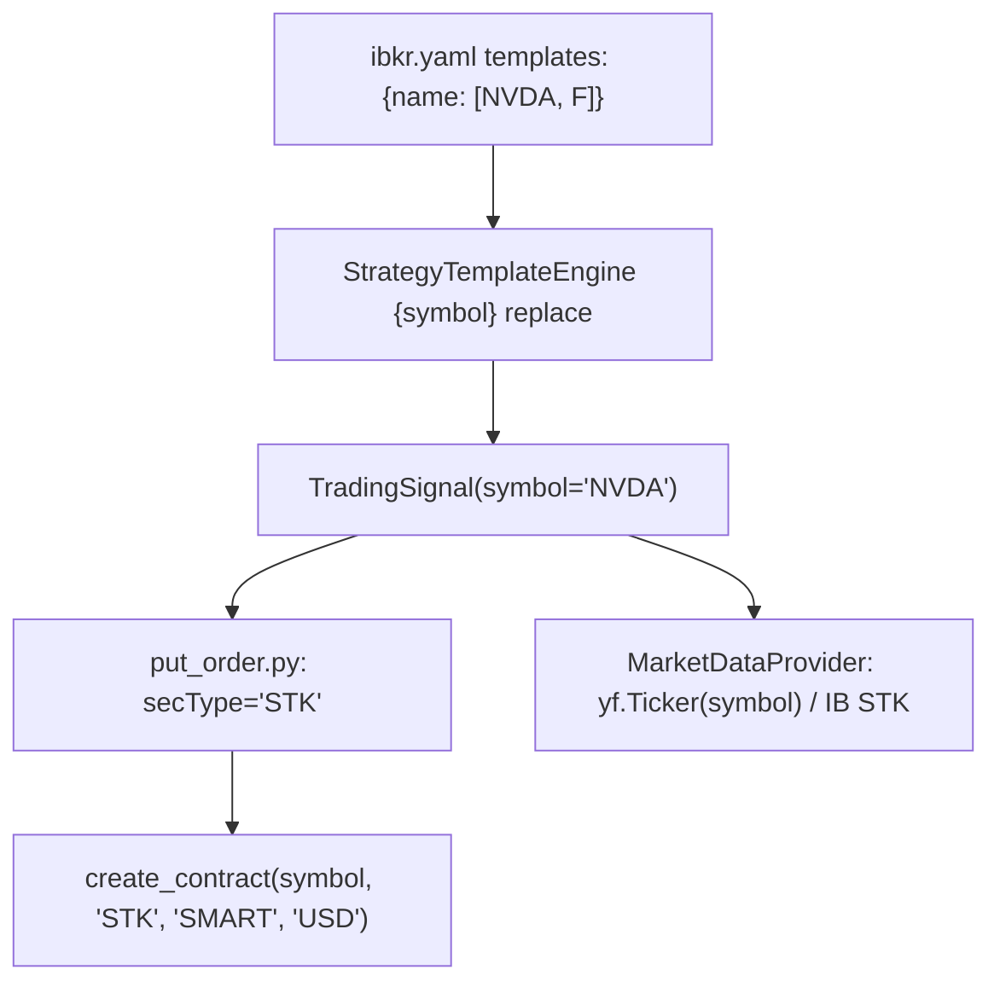
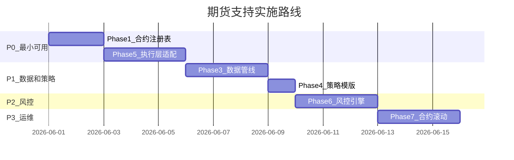

# 指数期货支持路线图

> 创建日期：2026-05-25
> 状态：规划中（未实施）
> 优先级：P2

---

## 一、概要

当前系统从配置到执行全链路硬编码 `secType="STK"`。添加 FUT 支持需要修改 6 个核心层：合约注册、配置结构、数据管线、策略模版、执行层、风控引擎。

目标产品：
- ES (E-mini S&P 500, multiplier=50)
- MES (Micro E-mini S&P 500, multiplier=5)
- NQ (E-mini NASDAQ 100, multiplier=20)
- MNQ (Micro E-mini NASDAQ 100, multiplier=2)

---

## 二、当前架构的 STK 硬编码点



| 文件 | 行/位置 | 硬编码内容 |
|------|---------|-----------|
| `src/trading/put_order.py:115` | 订单提交 | `sec_type = "STK"` |
| `src/core/client.py` | get_market_data | `create_contract(symbol, "STK", "SMART", "CAD")` |
| `src/core/client.py` | get_historical_data | `create_contract(symbol, "STK", "SMART", "USD")` |
| `src/core/market_data.py` | yfinance 调用 | `yf.Ticker(symbol)` 直接使用股票 ticker |
| `config/ibkr.yaml` | watch.templates | 仅平坦 symbol 字符串，无资产类别信息 |
| `src/core/risk_engine.py` | 持仓价值 | `qty * price`（无 multiplier） |

---

## 三、设计方案

### Phase 1: 合约注册表（Symbol Registry）

**新增文件**：`config/instruments.yaml`

将合约元数据从代码中抽离为配置：

```yaml
instruments:
  # 股票无需显式定义，系统默认 secType=STK, exchange=SMART, multiplier=1

  ES:
    sec_type: FUT
    exchange: CME
    currency: USD
    multiplier: 50
    trading_class: ES
    roll_rule: quarterly     # 季度合约: H(3月) M(6月) U(9月) Z(12月)
    front_month: "202506"
    yfinance_symbol: "ES=F"

  MES:
    sec_type: FUT
    exchange: CME
    currency: USD
    multiplier: 5
    trading_class: MES
    roll_rule: quarterly
    front_month: "202506"
    yfinance_symbol: "MES=F"

  NQ:
    sec_type: FUT
    exchange: CME
    currency: USD
    multiplier: 20
    trading_class: NQ
    roll_rule: quarterly
    front_month: "202506"
    yfinance_symbol: "NQ=F"

  MNQ:
    sec_type: FUT
    exchange: CME
    currency: USD
    multiplier: 2
    trading_class: MNQ
    roll_rule: quarterly
    front_month: "202506"
    yfinance_symbol: "MNQ=F"
```

**对应 Python dataclass**（新增至 `config/config.py`）：

```python
@dataclass
class InstrumentSpec:
    """合约规格 — 统一描述股票/期货/期权的交易所元数据"""
    symbol: str
    sec_type: str = "STK"
    exchange: str = "SMART"
    currency: str = "USD"
    multiplier: int = 1
    trading_class: str = ""
    front_month: str = ""           # YYYYMM 格式
    roll_rule: str = ""             # quarterly / monthly / none
    yfinance_symbol: str = ""       # 覆盖 yfinance ticker（如 ES=F）

    @property
    def is_futures(self) -> bool:
        return self.sec_type == "FUT"

    @property
    def notional_multiplier(self) -> int:
        """每点价值 = multiplier，股票为 1"""
        return self.multiplier


class InstrumentRegistry:
    """合约注册表 — 单例，启动时从 instruments.yaml 加载"""

    def __init__(self, config_path: str = "config/instruments.yaml"):
        self._specs: dict[str, InstrumentSpec] = {}
        self._load(config_path)

    def _load(self, path: str):
        # 从 YAML 加载，每个 key 构造 InstrumentSpec

    def get(self, symbol: str) -> InstrumentSpec:
        """查询合约规格，不存在则返回 STK 默认值"""
        return self._specs.get(symbol.upper(), InstrumentSpec(symbol=symbol.upper()))

    @property
    def futures_symbols(self) -> list[str]:
        return [s for s, spec in self._specs.items() if spec.is_futures]
```

---

### Phase 2: 配置层适配

`config/ibkr.yaml` 的 `watch.templates` 无需结构变更 — symbol 字符串继续作为 key：

```yaml
watch:
  templates:
    futures_trend: [ES, NQ, MES]     # 期货专用策略
    trend_entry: [NVDA, AVGO]        # 股票策略不变
    dip_buy: [F, AAPL, NVDA]         # 混合使用完全可以
```

系统通过 `InstrumentRegistry.get(symbol)` 查询合约元数据。规则：
- 注册表中存在 → 使用完整 FUT 参数
- 注册表中不存在 → 默认 STK/SMART/USD（当前行为）

**新增配置项**（`ibkr.yaml` 顶层）：

```yaml
ibkr:
  instruments_file: "config/instruments.yaml"    # 合约注册表路径
```

---

### Phase 3: 数据管线适配

**修改文件**：`src/core/market_data.py`

#### 3.1 yfinance 路径

```python
# Before
ticker = yf.Ticker(symbol)

# After
spec = self.registry.get(symbol)
yf_symbol = spec.yfinance_symbol or symbol
ticker = yf.Ticker(yf_symbol)
```

映射关系：
| 系统 symbol | yfinance ticker | 说明 |
|------------|-----------------|------|
| `ES` | `ES=F` | E-mini S&P 500 连续合约 |
| `NQ` | `NQ=F` | E-mini NASDAQ 连续 |
| `MES` | `MES=F` | Micro E-mini S&P |
| `NVDA` | `NVDA` | 股票不变 |

#### 3.2 IBKR 路径

```python
# Before
contract = create_contract(symbol, "STK", "SMART", "USD")

# After
spec = self.registry.get(symbol)
contract = create_contract(
    symbol=spec.symbol,
    sec_type=spec.sec_type,
    exchange=spec.exchange,
    currency=spec.currency,
    expiry=spec.front_month,        # FUT 必填
    multiplier=str(spec.multiplier),
    trading_class=spec.trading_class,
)
```

#### 3.3 期货特殊处理

| 问题 | 处理方式 |
|------|----------|
| 连续合约数据拼接 | yfinance `ES=F` 自动提供连续数据；IBKR 使用 `CONTFUT` 或手动拼接 |
| 交易时段（几乎 23h） | `_is_trading_now()` 按 sec_type 分流判断 |
| Volume 语义（合约数 vs 股数） | 对技术指标无影响，volume_ratio 仍有效 |
| 价格跳动（tick size） | ES=0.25 点=$12.5；limit order 需 round 到 tick |

---

### Phase 4: 策略模版适配

**新增文件**：`strategy/templates/futures_trend.yaml`

期货与股票的核心差异：
- `quantity` 含义变为**合约数**（1 合约 = multiplier * 价格点）
- 止损更紧（期货杠杆高）
- `tif` 常用 GTC（期货跨日持仓常见）
- 不需要 `dip_buy` 类策略（期货不适合摊薄成本）

```yaml
strategy_id: "FUTURES_TREND_{symbol}"
name: "{symbol} 期货趋势跟踪"
description: "{symbol} 均线多头 + 斜率确认后限价开仓"
enabled: true
priority: 20
weight: 1.2
state: ACTIVE
type: futures_trend
regime_weights:
  BULL: 1.5
  BEAR: 0.0
  SIDEWAYS: 0.5
signal_factors: ["market_data"]
conditions:
  operator: AND
  rules:
    - type: ma_stack
      operator: ">"
    - type: sma_slope
      period: 50
      threshold: 3
      multiplier: 30
    - type: volume_spike
      multiplier: 1.2
action:
  type: "LIMIT_BUY"
  quantity: 1                # 合约数
  ticker: "{symbol}"
  price_offset: -0.001       # 略低于市价
  tif: "GTC"
  risk:
    stop_loss_type: "fixed"
    stop_loss_pct: 0.02      # 2% 止损（期货杠杆下对应较大名义损失）
    take_profit_pct: 0.06    # 6% 止盈
    trailing_stop_pct: 0.03  # 3% 移动止损
```

**现有股票模版无需改动** — `quantity` 语义由执行层根据 `InstrumentSpec.sec_type` 解释。

---

### Phase 5: 执行层适配

**修改文件**：
- `src/trading/put_order.py` — 合约构造
- `src/core/orders.py` — bracket order
- `src/core/client.py` — `create_contract()` 签名扩展

#### 5.1 put_order.py 核心变更

```python
# Before (硬编码 STK)
sec_type = "STK"
exchange = "SMART"
currency = "USD"
contract = create_contract(symbol, sec_type, exchange, currency)

# After (从 registry 获取)
from config.config import get_instrument_registry
registry = get_instrument_registry()
spec = registry.get(symbol)
contract = create_contract(
    symbol=spec.symbol,
    sec_type=spec.sec_type,
    exchange=spec.exchange,
    currency=spec.currency,
    expiry=spec.front_month,
    multiplier=str(spec.multiplier) if spec.multiplier > 1 else "",
    trading_class=spec.trading_class,
)
```

#### 5.2 create_contract() 签名扩展

```python
def create_contract(
    symbol: str,
    sec_type: str = "STK",
    exchange: str = "SMART",
    currency: str = "USD",
    expiry: str = "",              # 新增：FUT 到期月 YYYYMM
    multiplier: str = "",          # 新增：合约乘数
    trading_class: str = "",       # 新增：交易类别
) -> Contract:
    contract = Contract()
    contract.symbol = symbol
    contract.secType = sec_type
    contract.exchange = exchange
    contract.currency = currency
    if expiry:
        contract.lastTradeDateOrContractMonth = expiry
    if multiplier:
        contract.multiplier = multiplier
    if trading_class:
        contract.tradingClass = trading_class
    return contract
```

#### 5.3 期货订单特殊性

| 差异 | 股票 | 期货 |
|------|------|------|
| 价格精度 | $0.01 | ES: $0.25 tick |
| 默认 TIF | DAY | GTC |
| 保证金 | 全额 | Initial margin (~5-12%) |
| 做空 | TFSA 禁止 | 正常操作 |
| 交割 | N/A | 现金结算（指数期货） |

执行层需增加 tick size rounding：

```python
def round_to_tick(price: float, tick_size: float) -> float:
    return round(price / tick_size) * tick_size
```

---

### Phase 6: 风控引擎适配

**修改文件**：`src/core/risk_engine.py`

#### 6.1 名义价值计算

```python
# Before
position_value = quantity * price

# After
spec = registry.get(symbol)
position_value = quantity * price * spec.notional_multiplier
# ES: 1 contract * 5300 * 50 = $265,000 名义价值
```

#### 6.2 账户类型分流

```python
class RiskEngine:
    def _apply_rules(self, symbol: str, action: str, ...):
        spec = registry.get(symbol)
        if spec.is_futures:
            return self._apply_futures_rules(...)
        else:
            return self._apply_equity_rules(...)  # 现有 TFSA 逻辑
```

| 规则 | 股票 (TFSA) | 期货 (Margin) |
|------|------------|---------------|
| 禁止做空 | true | false |
| 禁止日交易 | true | false |
| 最大持仓占比 | 20% NLV | N/A（用保证金） |
| 新增约束 | — | max_contracts_per_symbol |
| 年交易次数 | 80 | 不限 |

#### 6.3 新增配置

```yaml
risk_engine:
  futures:
    enabled: true
    max_contracts_per_symbol: 5      # 单品种最大合约数
    max_total_margin_pct: 50.0       # 总保证金占净值 %
    require_stop_loss: true          # 期货必须带止损
```

---

### Phase 7: 合约滚动（Roll）

期货合约有到期日，需要定期滚动到下一个合约月。

#### 7.1 滚动时机

CME 季度合约到期规则：
- 到期日 = 合约月第三个周五
- 建议滚动时间：到期前 5-8 个交易日（流动性转移）

#### 7.2 滚动策略

```python
class ContractRoller:
    def check_roll_needed(self, symbol: str) -> bool:
        """检查是否需要滚动"""
        spec = registry.get(symbol)
        expiry_date = parse_expiry(spec.front_month)
        days_to_expiry = (expiry_date - today).days
        return days_to_expiry <= 5

    def execute_roll(self, symbol: str):
        """执行滚动：平旧开新"""
        # 1. 计算下一合约月
        next_month = self._next_contract_month(spec.front_month, spec.roll_rule)
        # 2. 平仓当前合约
        # 3. 开仓新合约
        # 4. 更新 instruments.yaml 的 front_month
        # 5. 通知用户
```

#### 7.3 滚动模式

| 模式 | 说明 | 适用场景 |
|------|------|----------|
| 手动 | 通知用户，等待确认 | 初期部署 |
| 半自动 | 自动检测 + 生成 roll 信号 | 稳定后 |
| 全自动 | 检测 + 执行 + 更新配置 | 成熟后 |

---

## 四、涉及修改的文件清单

| 文件 | 变更类型 | 说明 |
|------|----------|------|
| `config/instruments.yaml` | **新增** | 合约注册表 |
| `config/config.py` | 修改 | 新增 `InstrumentSpec`, `InstrumentRegistry` |
| `config/ibkr.yaml` | 小改 | 新增 `instruments_file` 引用 |
| `src/core/client.py` | 修改 | `create_contract` 支持 FUT 字段（expiry, multiplier, tradingClass） |
| `src/core/market_data.py` | 修改 | yfinance_symbol 覆盖 + IB FUT 合约构造 |
| `src/trading/put_order.py` | 修改 | 从 registry 获取合约参数，去掉硬编码 STK |
| `src/core/orders.py` | 小改 | bracket order 适配 FUT |
| `src/core/risk_engine.py` | 修改 | notional 计算 + 账户类型分流 + 期货规则 |
| `src/trading/watch_daemon.py` | 小改 | 交易时段判断按 sec_type 分流 |
| `strategy/templates/futures_trend.yaml` | **新增** | 期货趋势跟踪模版 |

---

## 五、实施优先级



| 优先级 | Phase | 内容 | 预计工作量 | 前置依赖 |
|--------|-------|------|-----------|----------|
| P0 | Phase 1 | 合约注册表 | 1-2 天 | 无 |
| P0 | Phase 5 | 执行层适配 | 2-3 天 | Phase 1 |
| P1 | Phase 3 | 数据管线 | 2-3 天 | Phase 1 |
| P1 | Phase 4 | 策略模版 | 0.5 天 | Phase 3 |
| P1 | Phase 2 | 配置层 | 0.5 天 | Phase 1 |
| P2 | Phase 6 | 风控引擎 | 2-3 天 | Phase 5 |
| P3 | Phase 7 | 合约滚动 | 2-3 天 | Phase 5, 6 |

**最小可用路径**：Phase 1 + Phase 5 完成后，即可手动通过信号文件交易期货（使用 yfinance 获取报价）。

---

## 六、风险与注意事项

| 风险 | 影响 | 缓解措施 |
|------|------|----------|
| 期货杠杆导致大额亏损 | 账户爆仓 | 强制止损 + max_contracts 限制 |
| 合约到期未滚动 | 强制平仓/交割 | 到期前 8 天开始警告 |
| 连续合约价格跳空 | 技术指标失真 | 使用 back-adjusted 数据 |
| CME 交易时段与 NYSE 不同 | daemon 误判时段 | sec_type 分流判断 |
| TFSA 账户不能交易期货 | 订单被拒 | 账户类型检查前置拦截 |
| tick size 导致限价失败 | 订单 rejected | round_to_tick 强制对齐 |

---

## 七、测试计划

1. **单元测试**：InstrumentRegistry 加载 + 默认值回退
2. **集成测试**：Paper 环境提交 MES 订单验证合约构造
3. **数据验证**：yfinance `ES=F` 数据与 IBKR 实时对比
4. **风控测试**：验证 notional 计算含 multiplier
5. **滚动测试**：模拟到期场景验证检测逻辑
