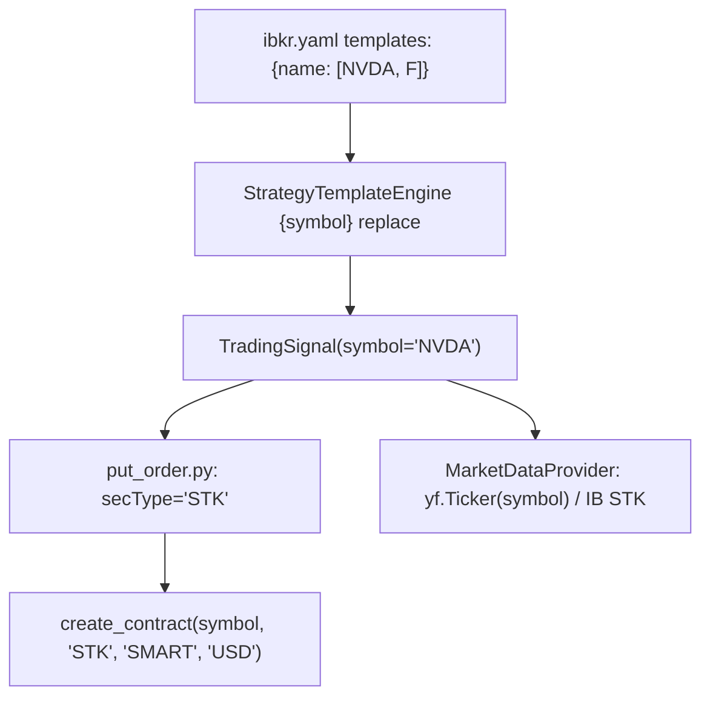
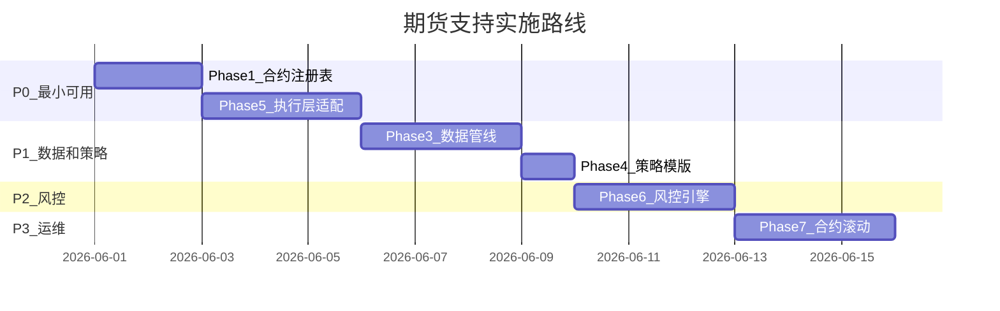

# 指数期货支持路线图

> 创建日期：2026-05-25
> 状态：规划中（未实施）
> 优先级：P2

---

## 一、概要

当前系统从配置到执行全链路硬编码 `secType="STK"`。添加 FUT 支持需要修改 6 个核心层：合约注册、配置结构、数据管线、策略模版、执行层、风控引擎。

目标产品：
- ES (E-mini S&P 500, multiplier=50)
- MES (Micro E-mini S&P 500, multiplier=5)
- NQ (E-mini NASDAQ 100, multiplier=20)
- MNQ (Micro E-mini NASDAQ 100, multiplier=2)

---

## 二、当前架构的 STK 硬编码点



| 文件 | 行/位置 | 硬编码内容 |
|------|---------|-----------|
| `src/trading/put_order.py:115` | 订单提交 | `sec_type = "STK"` |
| `src/core/client.py` | get_market_data | `create_contract(symbol, "STK", "SMART", "CAD")` |
| `src/core/client.py` | get_historical_data | `create_contract(symbol, "STK", "SMART", "USD")` |
| `src/core/market_data.py` | yfinance 调用 | `yf.Ticker(symbol)` 直接使用股票 ticker |
| `config/ibkr.yaml` | watch.templates | 仅平坦 symbol 字符串，无资产类别信息 |
| `src/core/risk_engine.py` | 持仓价值 | `qty * price`（无 multiplier） |

---

## 三、设计方案

### Phase 1: 合约注册表（Symbol Registry）

**新增文件**：`config/instruments.yaml`

将合约元数据从代码中抽离为配置：

```yaml
instruments:
  # 股票无需显式定义，系统默认 secType=STK, exchange=SMART, multiplier=1

  ES:
    sec_type: FUT
    exchange: CME
    currency: USD
    multiplier: 50
    trading_class: ES
    roll_rule: quarterly     # 季度合约: H(3月) M(6月) U(9月) Z(12月)
    front_month: "202506"
    yfinance_symbol: "ES=F"

  MES:
    sec_type: FUT
    exchange: CME
    currency: USD
    multiplier: 5
    trading_class: MES
    roll_rule: quarterly
    front_month: "202506"
    yfinance_symbol: "MES=F"

  NQ:
    sec_type: FUT
    exchange: CME
    currency: USD
    multiplier: 20
    trading_class: NQ
    roll_rule: quarterly
    front_month: "202506"
    yfinance_symbol: "NQ=F"

  MNQ:
    sec_type: FUT
    exchange: CME
    currency: USD
    multiplier: 2
    trading_class: MNQ
    roll_rule: quarterly
    front_month: "202506"
    yfinance_symbol: "MNQ=F"
```

#### `front_month` 字段说明

| 属性 | 说明 |
|------|------|
| 格式 | `YYYYMM`，如 `"202506"` 表示 2025 年 6 月合约 |
| 用途 | 传递给 IBKR API 的 `Contract.lastTradeDateOrContractMonth`，用于指定交易的具体合约月份 |
| 谁使用 | `put_order.py` 调用 `create_contract(expiry=spec.front_month)` |
| 何时更新 | 每个季度（ES/NQ 为 3/6/9/12 月第三个周五到期前），需手动或由 Phase 7 滚动模块自动更新为下一合约月 |
| 不更新的后果 | 到期后 IBKR 将拒绝该合约的订单（error 200: No security definition） |

**季度合约滚动日历** (CME E-mini / Micro):

| 合约月代码 | 到期月 | front_month 值 | 建议滚动时间 |
|-----------|--------|---------------|-------------|
| H | 3月 | `"202503"` | 3月第三个周五前 5 天 |
| M | 6月 | `"202506"` | 6月第三个周五前 5 天 |
| U | 9月 | `"202509"` | 9月第三个周五前 5 天 |
| Z | 12月 | `"202512"` | 12月第三个周五前 5 天 |

> **当前状态**：Phase 7（自动滚动）尚未实现，需要手动编辑 `config/instruments.yaml` 更新 `front_month` 值。

**对应 Python dataclass**（新增至 `config/config.py`）：

```python
@dataclass
class InstrumentSpec:
    """合约规格 — 统一描述股票/期货/期权的交易所元数据"""
    symbol: str
    sec_type: str = "STK"
    exchange: str = "SMART"
    currency: str = "USD"
    multiplier: int = 1
    trading_class: str = ""
    front_month: str = ""           # YYYYMM 格式
    roll_rule: str = ""             # quarterly / monthly / none
    yfinance_symbol: str = ""       # 覆盖 yfinance ticker（如 ES=F）

    @property
    def is_futures(self) -> bool:
        return self.sec_type == "FUT"

    @property
    def notional_multiplier(self) -> int:
        """每点价值 = multiplier，股票为 1"""
        return self.multiplier


class InstrumentRegistry:
    """合约注册表 — 单例，启动时从 instruments.yaml 加载"""

    def __init__(self, config_path: str = "config/instruments.yaml"):
        self._specs: dict[str, InstrumentSpec] = {}
        self._load(config_path)

    def _load(self, path: str):
        # 从 YAML 加载，每个 key 构造 InstrumentSpec

    def get(self, symbol: str) -> InstrumentSpec:
        """查询合约规格，不存在则返回 STK 默认值"""
        return self._specs.get(symbol.upper(), InstrumentSpec(symbol=symbol.upper()))

    @property
    def futures_symbols(self) -> list[str]:
        return [s for s, spec in self._specs.items() if spec.is_futures]
```

---

### Phase 2: 配置层适配

`config/ibkr.yaml` 的 `watch.templates` 无需结构变更 — symbol 字符串继续作为 key：

```yaml
watch:
  templates:
    futures_trend: [ES, NQ, MES]     # 期货专用策略
    trend_entry: [NVDA, AVGO]        # 股票策略不变
    dip_buy: [F, AAPL, NVDA]         # 混合使用完全可以
```

系统通过 `InstrumentRegistry.get(symbol)` 查询合约元数据。规则：
- 注册表中存在 → 使用完整 FUT 参数
- 注册表中不存在 → 默认 STK/SMART/USD（当前行为）

**新增配置项**（`ibkr.yaml` 顶层）：

```yaml
ibkr:
  instruments_file: "config/instruments.yaml"    # 合约注册表路径
```

---

### Phase 3: 数据管线适配

**修改文件**：`src/core/market_data.py`

#### 3.1 yfinance 路径

```python
# Before
ticker = yf.Ticker(symbol)

# After
spec = self.registry.get(symbol)
yf_symbol = spec.yfinance_symbol or symbol
ticker = yf.Ticker(yf_symbol)
```

映射关系：
| 系统 symbol | yfinance ticker | 说明 |
|------------|-----------------|------|
| `ES` | `ES=F` | E-mini S&P 500 连续合约 |
| `NQ` | `NQ=F` | E-mini NASDAQ 连续 |
| `MES` | `MES=F` | Micro E-mini S&P |
| `NVDA` | `NVDA` | 股票不变 |

#### 3.2 IBKR 路径

```python
# Before
contract = create_contract(symbol, "STK", "SMART", "USD")

# After
spec = self.registry.get(symbol)
contract = create_contract(
    symbol=spec.symbol,
    sec_type=spec.sec_type,
    exchange=spec.exchange,
    currency=spec.currency,
    expiry=spec.front_month,        # FUT 必填
    multiplier=str(spec.multiplier),
    trading_class=spec.trading_class,
)
```

#### 3.3 期货特殊处理

| 问题 | 处理方式 |
|------|----------|
| 连续合约数据拼接 | yfinance `ES=F` 自动提供连续数据；IBKR 使用 `CONTFUT` 或手动拼接 |
| 交易时段（几乎 23h） | `_is_trading_now()` 按 sec_type 分流判断 |
| Volume 语义（合约数 vs 股数） | 对技术指标无影响，volume_ratio 仍有效 |
| 价格跳动（tick size） | ES=0.25 点=$12.5；limit order 需 round 到 tick |

---

### Phase 4: 策略模版适配

**新增文件**：`strategy/templates/futures_trend.yaml`

期货与股票的核心差异：
- `quantity` 含义变为**合约数**（1 合约 = multiplier * 价格点）
- 止损更紧（期货杠杆高）
- `tif` 常用 GTC（期货跨日持仓常见）
- 不需要 `dip_buy` 类策略（期货不适合摊薄成本）

```yaml
strategy_id: "FUTURES_TREND_{symbol}"
name: "{symbol} 期货趋势跟踪"
description: "{symbol} 均线多头 + 斜率确认后限价开仓"
enabled: true
priority: 20
weight: 1.2
state: ACTIVE
type: futures_trend
regime_weights:
  BULL: 1.5
  BEAR: 0.0
  SIDEWAYS: 0.5
signal_factors: ["market_data"]
conditions:
  operator: AND
  rules:
    - type: ma_stack
      operator: ">"
    - type: sma_slope
      period: 50
      threshold: 3
      multiplier: 30
    - type: volume_spike
      multiplier: 1.2
action:
  type: "LIMIT_BUY"
  quantity: 1                # 合约数
  ticker: "{symbol}"
  price_offset: -0.001       # 略低于市价
  tif: "GTC"
  risk:
    stop_loss_type: "fixed"
    stop_loss_pct: 0.02      # 2% 止损（期货杠杆下对应较大名义损失）
    take_profit_pct: 0.06    # 6% 止盈
    trailing_stop_pct: 0.03  # 3% 移动止损
```

**现有股票模版无需改动** — `quantity` 语义由执行层根据 `InstrumentSpec.sec_type` 解释。

---

### Phase 5: 执行层适配

**修改文件**：
- `src/trading/put_order.py` — 合约构造
- `src/core/orders.py` — bracket order
- `src/core/client.py` — `create_contract()` 签名扩展

#### 5.1 put_order.py 核心变更

```python
# Before (硬编码 STK)
sec_type = "STK"
exchange = "SMART"
currency = "USD"
contract = create_contract(symbol, sec_type, exchange, currency)

# After (从 registry 获取)
from config.config import get_instrument_registry
registry = get_instrument_registry()
spec = registry.get(symbol)
contract = create_contract(
    symbol=spec.symbol,
    sec_type=spec.sec_type,
    exchange=spec.exchange,
    currency=spec.currency,
    expiry=spec.front_month,
    multiplier=str(spec.multiplier) if spec.multiplier > 1 else "",
    trading_class=spec.trading_class,
)
```

#### 5.2 create_contract() 签名扩展

```python
def create_contract(
    symbol: str,
    sec_type: str = "STK",
    exchange: str = "SMART",
    currency: str = "USD",
    expiry: str = "",              # 新增：FUT 到期月 YYYYMM
    multiplier: str = "",          # 新增：合约乘数
    trading_class: str = "",       # 新增：交易类别
) -> Contract:
    contract = Contract()
    contract.symbol = symbol
    contract.secType = sec_type
    contract.exchange = exchange
    contract.currency = currency
    if expiry:
        contract.lastTradeDateOrContractMonth = expiry
    if multiplier:
        contract.multiplier = multiplier
    if trading_class:
        contract.tradingClass = trading_class
    return contract
```

#### 5.3 期货订单特殊性

| 差异 | 股票 | 期货 |
|------|------|------|
| 价格精度 | $0.01 | ES: $0.25 tick |
| 默认 TIF | DAY | GTC |
| 保证金 | 全额 | Initial margin (~5-12%) |
| 做空 | TFSA 禁止 | 正常操作 |
| 交割 | N/A | 现金结算（指数期货） |

执行层需增加 tick size rounding：

```python
def round_to_tick(price: float, tick_size: float) -> float:
    return round(price / tick_size) * tick_size
```

---

### Phase 6: 风控引擎适配

**修改文件**：`src/core/risk_engine.py`

#### 6.1 名义价值计算

```python
# Before
position_value = quantity * price

# After
spec = registry.get(symbol)
position_value = quantity * price * spec.notional_multiplier
# ES: 1 contract * 5300 * 50 = $265,000 名义价值
```

#### 6.2 账户类型分流

```python
class RiskEngine:
    def _apply_rules(self, symbol: str, action: str, ...):
        spec = registry.get(symbol)
        if spec.is_futures:
            return self._apply_futures_rules(...)
        else:
            return self._apply_equity_rules(...)  # 现有 TFSA 逻辑
```

| 规则 | 股票 (TFSA) | 期货 (Margin) |
|------|------------|---------------|
| 禁止做空 | true | false |
| 禁止日交易 | true | false |
| 最大持仓占比 | 20% NLV | N/A（用保证金） |
| 新增约束 | — | max_contracts_per_symbol |
| 年交易次数 | 80 | 不限 |

#### 6.3 新增配置

```yaml
risk_engine:
  futures:
    enabled: true
    max_contracts_per_symbol: 5      # 单品种最大合约数
    max_total_margin_pct: 50.0       # 总保证金占净值 %
    require_stop_loss: true          # 期货必须带止损
```

---

### Phase 7: 合约滚动（Roll）

期货合约有到期日，需要定期滚动到下一个合约月。

#### 7.1 滚动时机

CME 季度合约到期规则：
- 到期日 = 合约月第三个周五
- 建议滚动时间：到期前 5-8 个交易日（流动性转移）

#### 7.2 滚动策略

```python
class ContractRoller:
    def check_roll_needed(self, symbol: str) -> bool:
        """检查是否需要滚动"""
        spec = registry.get(symbol)
        expiry_date = parse_expiry(spec.front_month)
        days_to_expiry = (expiry_date - today).days
        return days_to_expiry <= 5

    def execute_roll(self, symbol: str):
        """执行滚动：平旧开新"""
        # 1. 计算下一合约月
        next_month = self._next_contract_month(spec.front_month, spec.roll_rule)
        # 2. 平仓当前合约
        # 3. 开仓新合约
        # 4. 更新 instruments.yaml 的 front_month
        # 5. 通知用户
```

#### 7.3 滚动模式

| 模式 | 说明 | 适用场景 |
|------|------|----------|
| 手动 | 通知用户，等待确认 | 初期部署 |
| 半自动 | 自动检测 + 生成 roll 信号 | 稳定后 |
| 全自动 | 检测 + 执行 + 更新配置 | 成熟后 |

---

## 四、涉及修改的文件清单

| 文件 | 变更类型 | 说明 |
|------|----------|------|
| `config/instruments.yaml` | **新增** | 合约注册表 |
| `config/config.py` | 修改 | 新增 `InstrumentSpec`, `InstrumentRegistry` |
| `config/ibkr.yaml` | 小改 | 新增 `instruments_file` 引用 |
| `src/core/client.py` | 修改 | `create_contract` 支持 FUT 字段（expiry, multiplier, tradingClass） |
| `src/core/market_data.py` | 修改 | yfinance_symbol 覆盖 + IB FUT 合约构造 |
| `src/trading/put_order.py` | 修改 | 从 registry 获取合约参数，去掉硬编码 STK |
| `src/core/orders.py` | 小改 | bracket order 适配 FUT |
| `src/core/risk_engine.py` | 修改 | notional 计算 + 账户类型分流 + 期货规则 |
| `src/trading/watch_daemon.py` | 小改 | 交易时段判断按 sec_type 分流 |
| `strategy/templates/futures_trend.yaml` | **新增** | 期货趋势跟踪模版 |

---

## 五、实施优先级



| 优先级 | Phase | 内容 | 预计工作量 | 前置依赖 |
|--------|-------|------|-----------|----------|
| P0 | Phase 1 | 合约注册表 | 1-2 天 | 无 |
| P0 | Phase 5 | 执行层适配 | 2-3 天 | Phase 1 |
| P1 | Phase 3 | 数据管线 | 2-3 天 | Phase 1 |
| P1 | Phase 4 | 策略模版 | 0.5 天 | Phase 3 |
| P1 | Phase 2 | 配置层 | 0.5 天 | Phase 1 |
| P2 | Phase 6 | 风控引擎 | 2-3 天 | Phase 5 |
| P3 | Phase 7 | 合约滚动 | 2-3 天 | Phase 5, 6 |

**最小可用路径**：Phase 1 + Phase 5 完成后，即可手动通过信号文件交易期货（使用 yfinance 获取报价）。

---

## 六、风险与注意事项

| 风险 | 影响 | 缓解措施 |
|------|------|----------|
| 期货杠杆导致大额亏损 | 账户爆仓 | 强制止损 + max_contracts 限制 |
| 合约到期未滚动 | 强制平仓/交割 | 到期前 8 天开始警告 |
| 连续合约价格跳空 | 技术指标失真 | 使用 back-adjusted 数据 |
| CME 交易时段与 NYSE 不同 | daemon 误判时段 | sec_type 分流判断 |
| TFSA 账户不能交易期货 | 订单被拒 | 账户类型检查前置拦截 |
| tick size 导致限价失败 | 订单 rejected | round_to_tick 强制对齐 |

---

## 七、信号 → 订单数据流

期货策略 (如 `futures_trend.yaml`) 产生的信号与股票策略走同一条数据管线，不做特殊分流。

### 完整流程

```
watch_daemon.run()
  │
  ├─ 1) StrategyFactory 加载 futures_trend 模版，展开为 FUTURES_TREND_ES 等策略
  │
  ├─ 2) MarketDataProvider.fetch_historical("ES")
  │     └─ _resolve_yfinance_symbol() → 使用 "ES=F" 从 yfinance 拉取日K
  │
  ├─ 3) 条件评估通过 → 生成 TradingSignal
  │
  ├─ 4) convert_signal_to_dict() 序列化
  │
  ├─ 5) 写入信号文件:
  │     data/<mode>/signals/signal_YYYYMMDD.json
  │     ├─ signals_pre_market[]   (盘前/盘后触发)
  │     └─ signals_intra_day[]    (盘中触发)
  │
  ├─ 6) 调用执行器:
  │     ├─ PreMarketExecutor  → 读取 signals_pre_market
  │     └─ IntraDayExecutor   → 读取 signals_intra_day
  │
  ├─ 7) put_order.process_signals()
  │     ├─ get_instrument_registry().get("ES")  → InstrumentSpec(FUT, CME, 50...)
  │     ├─ create_contract("ES", sec_type="FUT", expiry="202506", multiplier="50", ...)
  │     ├─ RiskEngine.precheck_order("ES", ...)
  │     │   ├─ _is_futures_symbol() == True → 跳过 TFSA 规则
  │     │   └─ _get_notional_value() = qty * price * 50  (仓位/金额检查)
  │     └─ place_order(client, order, contract)
  │
  └─ 8) 订单结果写入:
        data/<mode>/orders/order_YYYYMMDD.json
        ├─ orders_pre_market[]
        └─ orders_intra_day[]
```

### 文件路径说明

| 数据类型 | Paper 模式路径 | Real 模式路径 |
|---------|---------------|--------------|
| 信号文件 | `data/paper/signals/signal_YYYYMMDD.json` | `data/real/signals/signal_YYYYMMDD.json` |
| 订单文件 | `data/paper/orders/order_YYYYMMDD.json` | `data/real/orders/order_YYYYMMDD.json` |
| 报告文件 | `data/paper/reports/pre-report_YYYYMMDD.md` | `data/real/reports/pre-report_YYYYMMDD.md` |

`<mode>` 由 `resolve_data_mode(account_id)` 决定：DU 前缀 = paper，其余 = real。

### 信号 JSON 结构 (期货示例)

```json
{
  "generated": "2026-05-25 09:00:00",
  "signals_pre_market": [
    {
      "strategy_name": "ES 期货趋势跟踪",
      "strategy_id": "FUTURES_TREND_ES",
      "symbol": "ES",
      "action": "BUY",
      "quantity": 1,
      "target_price": 5380.25,
      "reason": "MA stack bullish + slope confirmed",
      "stop_loss_type": "fixed_pct",
      "stop_loss_pct": 0.02,
      "take_profit_pct": 0.06,
      "trailing_stop_pct": 0.03,
      "processed": false
    }
  ]
}
```

### 与股票信号的区别

| 维度 | 股票 | 期货 |
|------|------|------|
| symbol 解析 | 直接使用或 .TO 后缀处理 | registry 提供 exchange/expiry/multiplier |
| yfinance ticker | 原样 (如 `NVDA`) | 映射为 `ES=F` |
| TFSA 风控 | 全量执行 (short_sell, day_trading, yearly_limit) | 跳过 TFSA 规则 |
| notional 计算 | qty × price | qty × price × multiplier |
| Contract 构造 | `create_contract("NVDA")` | `create_contract("ES", sec_type="FUT", expiry=..., multiplier=..., trading_class=...)` |

---

## 八、测试指南（详细操作手册）

### 8.1 前置条件

| 条件 | 说明 |
|------|------|
| IBKR Gateway/TWS 运行 | Paper 账户 (DU 前缀) 连接端口 4002 |
| Python 依赖安装 | `pip install ibapi pyyaml yfinance exchange_calendars` |
| 账户有期货交易权限 | Paper 账户默认开启 CME 权限；若报错检查 TWS Account > Trading Permissions |
| CME 市场数据订阅 | TWS > Account Management > Market Data 勾选 CME (Paper 免费延迟行情) |

### 8.2 启用期货策略（步骤）

**Step 1**: 编辑 `config/ibkr.yaml`，将期货 symbol 加入 `futures_trend` 模板：

```yaml
    templates:
      # ... 其他模板 ...
      futures_trend: [MES]    # 建议先用 Micro (MES/MNQ)，乘数小风险低
```

**Step 2**: 确认 `config/instruments.yaml` 中 `front_month` 是当前合约月：

```yaml
  MES:
    sec_type: FUT
    exchange: CME
    currency: USD
    multiplier: 5
    trading_class: MES
    roll_rule: quarterly
    front_month: "202506"      # ← 确认未到期！当前是 2026 年需改为 "202609"
    yfinance_symbol: "MES=F"
```

> **关键**：`front_month` 必须是当前活跃合约月，过期值会导致 IBKR 报错 "No security definition"。
> 查看当前活跃合约月：在 TWS 中搜索 MES，看哪个月份有行情。

**Step 3**: 确认策略模板 `strategy/templates/futures_trend.yaml` 中 `quantity` 适合测试：

```yaml
action:
  type: "LIMIT_BUY"
  quantity: 1            # MES x1 = ~$5 x 5400 = ~$27000 notional
  price_offset: -0.001
```

### 8.3 运行测试

#### 方式 A：通过 watch_daemon 完整流程

```bash
# 单 symbol 监控（推荐调试用）
python3 src/trading/watch_daemon.py MES
```

观察日志：
- `StrategyFactory` 是否加载了 `FUTURES_TREND_MES` 策略
- `MarketDataProvider` 是否使用 `MES=F` 拉取 yfinance 数据
- 条件评估是否通过/未通过及原因

#### 方式 B：仅验证信号生成（不提交订单）

设置 `approval_required: true` 阻止自动执行：

```yaml
  risk_engine:
    approval_required: true    # ← 信号入审批队列，不自动提交
```

然后运行 daemon，信号会出现在审批队列但不会提交到 IBKR。

#### 方式 C：直接运行回归测试

```bash
python3 tests/test_instrument_registry.py
```

验证 registry、contract 构造、risk engine 的基本正确性（不需要 IBKR 连接）。

### 8.4 验证检查清单

| # | 验证项 | 如何确认 | 预期结果 |
|---|--------|----------|----------|
| 1 | Registry 加载 | 日志或测试脚本 | `get("MES").sec_type == "FUT"`, `multiplier == 5` |
| 2 | yfinance 数据 | daemon 日志 `fetch_historical` | 使用 `MES=F` ticker，返回非空 K 线 |
| 3 | 条件评估 | daemon 日志 | 显示 `ma_stack`/`sma_slope`/`rsi`/`volume_spike` 各条件是否 pass |
| 4 | 信号文件写入 | 检查 `data/paper/signals/signal_YYYYMMDD.json` | 含 `strategy_id: "FUTURES_TREND_MES"` 的信号条目 |
| 5 | Contract 构造 | daemon/put_order 日志 | `secType=FUT, exchange=CME, expiry=202506, multiplier=5, tradingClass=MES` |
| 6 | 风控跳过 TFSA | 日志无 `SHORT_SELL` / `DAY_TRADING` / `YEARLY_TRADE_LIMIT` 拦截 | 只检查 position_limit 和 order_value |
| 7 | Notional 正确 | 风控日志的 `order_value` | qty=1, price=5400 → notional = $27,000 (而非 $5,400) |
| 8 | 订单提交 | `data/paper/orders/order_YYYYMMDD.json` | 含 MES 订单，status 为 Submitted/Filled |
| 9 | 现有股票不受影响 | 同时跑 NVDA 等 | 股票信号正常生成，TFSA 规则正常执行 |

### 8.5 常见问题排查

| 错误 | 原因 | 解决 |
|------|------|------|
| `No security definition has been found` | `front_month` 过期或格式错误 | 更新 `instruments.yaml` 中的 `front_month` 为当前活跃合约月 |
| `yfinance [MES] 下载历史数据为空` | yfinance 对 `MES=F` 支持不稳定 | 改用 `ES=F`（ES 流动性高，数据更可靠），或切换 `data_source: ibkr` |
| `风控拦截: ORDER_VALUE_LIMIT` | notional (qty × price × multiplier) 超过 `max_order_value_pct` | 降低 quantity 或调整 `max_order_value_pct` |
| 条件始终不触发 | 期货市场状态不满足（如横盘无趋势） | 降低 `futures_trend.yaml` 中的阈值做测试，或手动构造信号验证执行层 |
| `registry.get("MES")` 返回 STK | `instruments.yaml` 未被加载 | 确认文件路径正确，YAML 格式无语法错误 |

### 8.6 手动构造信号测试执行层（跳过条件评估）

如果条件不满足无法触发信号，可手动写入信号文件来测试 put_order → IBKR 执行层：

```bash
# 创建今日信号文件（Paper 模式）
cat > data/paper/signals/signal_$(date +%Y%m%d).json << 'EOF'
{
  "generated": "2026-05-25 09:00:00",
  "signals_pre_market": [
    {
      "strategy_name": "MES 期货趋势跟踪",
      "strategy_id": "FUTURES_TREND_MES",
      "symbol": "MES",
      "action": "BUY",
      "quantity": 1,
      "target_price": 5380.0,
      "reason": "手动测试",
      "confidence": 0.8,
      "weight": 1.0,
      "priority": 25,
      "stop_loss_type": "fixed_pct",
      "stop_loss_pct": 0.02,
      "take_profit_pct": 0.06,
      "trailing_stop_pct": 0.03,
      "processed": false
    }
  ],
  "signals_intra_day": []
}
EOF
```

然后运行 pre_market executor：

```bash
python3 -c "from src.trading.pre_market import execute; execute()"
```

检查 `data/paper/orders/order_YYYYMMDD.json` 中是否出现对应订单。

### 8.7 `instruments.yaml` 字段完整参考

| 字段 | 类型 | 必填 | 说明 |
|------|------|------|------|
| `sec_type` | str | 是 | 证券类型：`FUT` (期货)、`STK` (股票) |
| `exchange` | str | 是 | 交易所：`CME` (芝商所)、`SMART` (智能路由) |
| `currency` | str | 是 | 货币：`USD` |
| `multiplier` | int | 是 | 合约乘数：ES=50, MES=5, NQ=20, MNQ=2 |
| `trading_class` | str | 是 | 交易类别，IBKR 用于区分同 symbol 的不同产品 |
| `roll_rule` | str | 否 | 滚动规则：`quarterly` (3/6/9/12月) / `monthly` |
| `front_month` | str | **是** | 当前活跃合约月 `YYYYMM`，**过期必须手动更新** |
| `yfinance_symbol` | str | 否 | yfinance ticker 覆盖，如 `ES=F`；留空则使用原始 symbol |

### 8.8 测试完成后清理

```bash
# 如果不想保留期货模板绑定
# 将 ibkr.yaml 中 futures_trend 改回空列表:
#   futures_trend: []
```

---

## 九、未实现功能（Phase 7+）

| 功能 | 状态 | 说明 |
|------|------|------|
| 合约自动滚动 | 未实现 | 需监控 `front_month` 到期，自动平旧开新并更新 YAML |
| tick size 对齐 | 未实现 | ES tick=0.25, MES tick=0.25; 限价需 `round_to_tick()` |
| 交易时段判断 | 未适配 | CME Globex 近 23h 交易，当前 daemon 只判断 NYSE 9:30-16:00 |
| 保证金检查 | 未实现 | 期货使用保证金而非全额，风控应检查 margin requirement |
| 多账户分流 | 未实现 | TFSA 不能交易期货，需路由到 margin 账户 |
